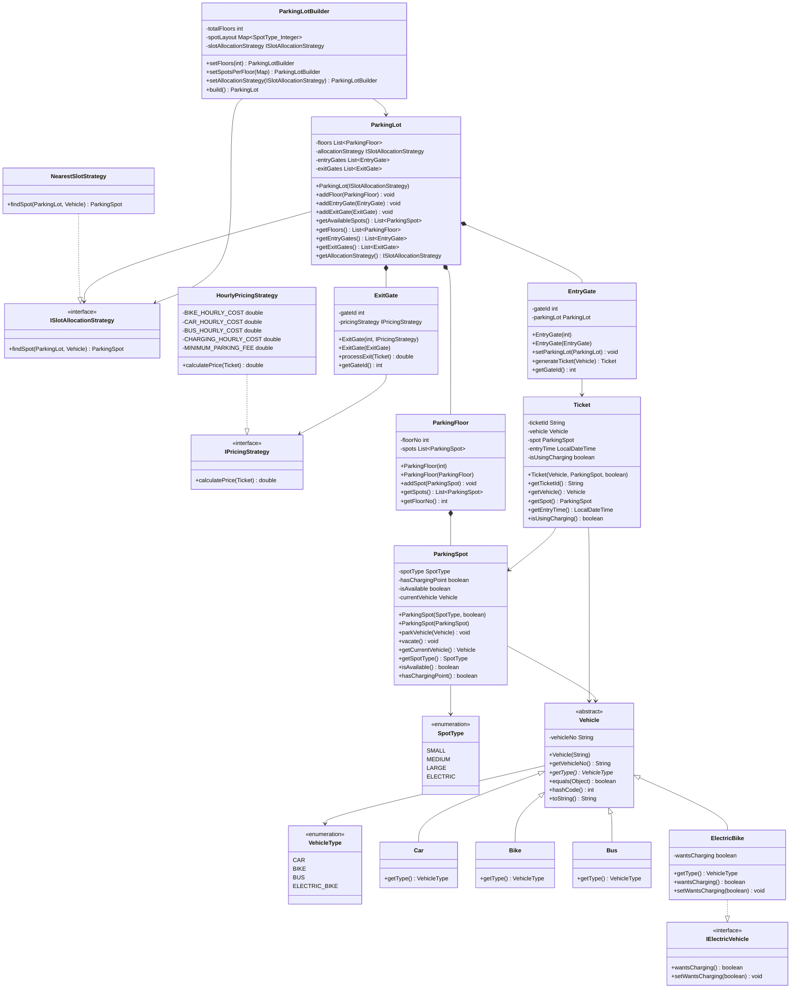

# Smart Parking Lot System

An implementation of a parking lot management system demonstrating object-oriented design patterns with multi-floor support, electric vehicle charging, and flexible strategies.

## Features

- **Multi-floor Structure**: Configurable floors with different spot types
- **Vehicle Support**: Cars, Bikes, Buses, and Electric Bikes with charging
- **Smart Allocation**: Strategy-based spot assignment algorithms
- **Dynamic Pricing**: Configurable pricing strategies per exit gate
- **Gate Management**: Separate entry and exit processing
- **Builder Pattern**: Flexible parking lot construction

## Class Diagram



## Quick Usage

```java
// Build parking lot
Map<SpotType, Integer> layout = Map.of(
    SpotType.SMALL, 5,    SpotType.MEDIUM, 3,
    SpotType.LARGE, 2,    SpotType.ELECTRIC, 2
);

ParkingLot mall = new ParkingLotBuilder()
    .setFloors(2)
    .setSpotsPerFloor(layout)
    .setAllocationStrategy(new NearestSlotStrategy())
    .build();

// Add gates
mall.addEntryGate(new EntryGate(1));
mall.addExitGate(new ExitGate(1, new HourlyPricingStrategy()));

// Park and exit
Vehicle bike = new Bike("KA01AB1234");
Ticket ticket = mall.getEntryGates().get(0).generateTicket(bike);
double fee = mall.getExitGates().get(0).processExit(ticket);
ticket.getSpot().vacate();
```

## Key Design Features

- **Strategy Pattern**: Pluggable allocation and pricing algorithms
- **Builder Pattern**: Flexible parking lot construction  
- **Deep Copying**: All getters return defensive copies
- **Type Safety**: Strong enum-based typing
- **Electric Vehicle Support**: Dedicated charging infrastructure
- **Extensible Architecture**: Easy to add new vehicle types and strategies

Run `ParkingLotDemo.java` to see the complete system in action.